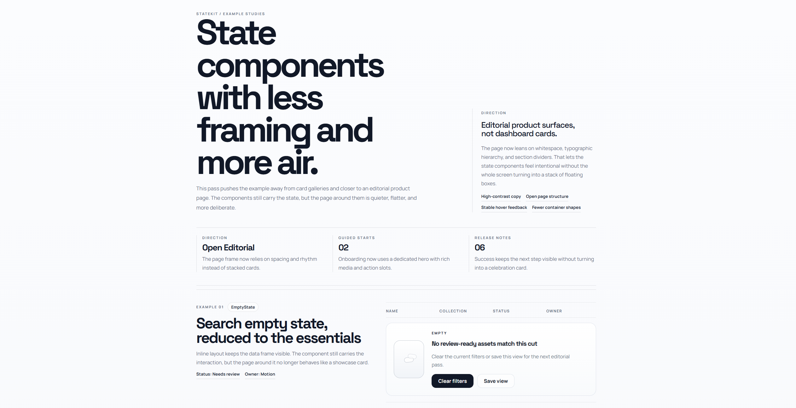
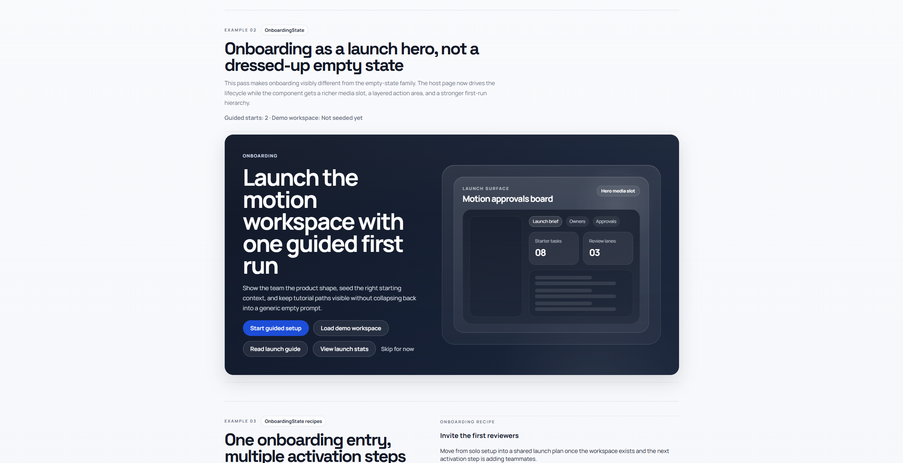
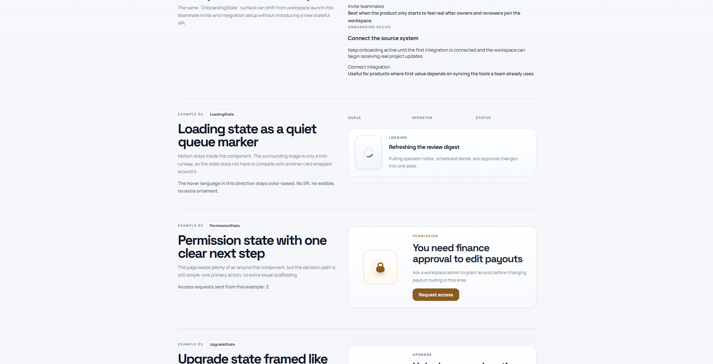
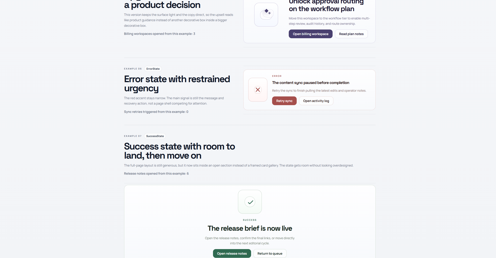

# StateKit

Category-first state UI for SaaS products built with Vue.

[简体中文](./README.zh-CN.md)

StateKit focuses on the product states teams rebuild constantly but rarely standardize well: empty, onboarding, loading, error, permission, upgrade, and success. It is not a button kit, form kit, or general design system. It is a narrow layer for product-grade state surfaces and workflow checkpoints.

## Example






## Online Docs

- Docs site: https://state-kit-vue-docs.vercel.app/
- Start with `/recipes` to browse preset recipes and `/docs/installation` for the install guide.
- Legacy `/blocks` routes still redirect to `/recipes` for compatibility.

## What StateKit Ships

StateKit currently exposes seven public category-first components:

- `EmptyState`
- `OnboardingState`
- `LoadingState`
- `ErrorState`
- `PermissionState`
- `UpgradeState`
- `SuccessState`

Those public entries are backed by 21 preset recipes across the same seven categories. Older scenario-specific exports such as `EmptySearchState` and `OfflineErrorState` still exist as deprecated compatibility exports, so existing integrations can migrate gradually.

Onboarding now ships as its own category through `OnboardingState`. The older `FirstProjectState` preset still exists, but it now reads as a post-setup empty-state bridge rather than the primary onboarding surface.

## Quick Start

```bash
npm install @statekit-vue/vue
```

```vue
<script setup lang="ts">
import { ref } from "vue";
import "@statekit-vue/vue/styles.css";
import { EmptyState } from "@statekit-vue/vue";

const clearing = ref(false);

async function handleClearFilters() {
  clearing.value = true;
  try {
    await Promise.resolve();
  } finally {
    clearing.value = false;
  }
}
</script>

<template>
  <EmptyState
    title="No matching invoices"
    description="Try a different keyword or clear your current filters."
    :primary-action="{
      label: 'Clear filters',
      onClick: handleClearFilters,
      loading: clearing,
      loadingLabel: 'Clearing filters...',
    }"
    :secondary-action="{
      label: 'Create invoice',
      href: '/invoices/new',
    }"
  />
</template>
```

## Unified Props API

All public entries and preset recipes share the same base prop surface:

- `title`
- `description`
- `tone`
- `density`
- `layout`
- `primaryAction`
- `secondaryAction`

Supported layouts:

- `inline`
- `panel`
- `page`

Supported tones:

- `neutral`
- `brand`
- `danger`
- `warning`
- `success`

## CTA Action Object

`primaryAction` and `secondaryAction` both accept `StateAction | null | undefined`.

A `StateAction` can include:

- `label`: required button text
- `href`: optional link target; when present the action renders as an anchor
- `onClick`: optional click handler for buttons or links
- `loading`: optional busy state controlled by the consumer
- `loadingLabel`: optional busy text that replaces the default `Working...`
- `disabled`: optional unavailable state that keeps the action visible

Passing rules:

- Use plain attributes for fixed strings and enum values such as `layout="panel"` or `tone="brand"`.
- Use `:` bindings for variables, objects, booleans, and `null`.
- In Vue templates, prop names stay kebab-case: `primaryAction` becomes `primary-action`, and `secondaryAction` becomes `secondary-action`.
- Leaving an action prop `undefined` keeps the preset default.
- Passing `null` removes the preset action explicitly.
- Put CTA behavior inside `primaryAction.onClick` or `secondaryAction.onClick`, not on the component root.

## Docs And Examples

- Online docs: https://state-kit-vue-docs.vercel.app/
- `npm run dev:docs` opens the local docs app with recipe previews, installation guidance, and example routes.
- The docs app now uses `/recipes` as the primary route family and preserves `/blocks` redirects for compatibility.
- Each recipe detail page documents:
  - how to customize `title` and `description`
  - how to pass props directly, from `<script setup>`, or through `v-bind`
  - how to wire `primaryAction` and `secondaryAction`
  - how to use `onClick`, `href`, `loading`, `loadingLabel`, `disabled`, and `null`
- The docs example routes cover:
  - `Admin Empty States`
  - `Permissions And Upgrade`
  - `Task Flow`
- `npm run dev:example` opens the external admin-style integration example in `examples/vite-vue-admin`.

## Repository Layout

```text
apps/docs
packages/shared
packages/vue
examples/vite-vue-admin
docs
```

- `apps/docs`: local documentation app with recipe previews, detailed recipe guides, installation guidance, and workflow examples
- `packages/shared`: shared types, ids, metadata, and priority lists that act as the single source of truth
- `packages/vue`: Vue components, compatibility exports, and the default stylesheet
- `examples/vite-vue-admin`: admin-style integration example using the current action API
- `docs`: internal product, implementation, QA, and release documentation

## Local Development

Run these commands from the workspace root:

```bash
npm run dev:docs
npm run dev:example
npm run typecheck
npm run build
```

Release-prep checks:

```bash
npm run pack:check
npm run smoke:install
```

## Docs And Release Notes

- Read internal planning and specs in [`docs/`](./docs)
- See versioned release notes in [`CHANGELOG.md`](./docs/交接/CHANGELOG.md)

## Positioning

Use StateKit when you want consistent state interfaces for SaaS dashboards, admin panels, workspaces, and collaboration products without re-deciding layout, tone, and CTA structure for every edge case.

Do not use StateKit as a replacement for a full design system. It is intentionally narrow: category-first state interfaces and preset recipes, not general UI primitives.
